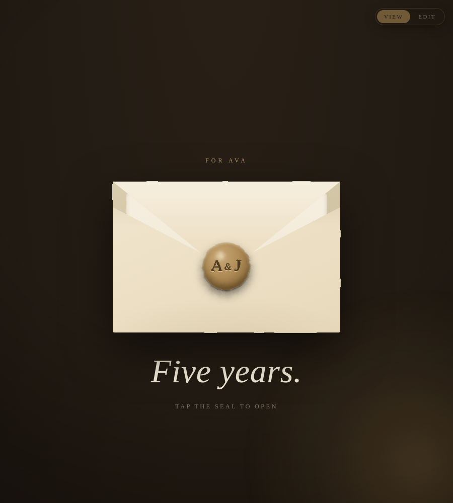

# Under the Same Sky — An Anniversary Keepsake

A private, scrolling keepsake website, charted like an antique star atlas.
It opens on a slowly turning planisphere with your two initials, then unfolds
as you scroll: the night you met, your photographs in oval gold lockets, your
years drawn star-by-star into a constellation of their own, a catalogue of
small things you love, a letter on cream paper, and finally every night
you've spent together — counted live, every time it's opened.

A small moon in the corner waxes as you read: new moon at the beginning,
full moon by the end.

Everything is **one single file** (`index.html`). No build step, no
accounts, no code required. You change the words and photos right in the
browser.



---

## Quick start

1. **Open it.** Double-click `index.html` and it opens in your web browser.
2. **Write it.** Tap **Write** in the top-right corner.
   - Tap any line of words to rewrite it.
   - Tap either oval locket to choose a photograph from your device.
   - Tap **Reset** in the bottom bar to undo everything back to the original.
3. **Gift it.** Tap **Gift** to see the finished keepsake.
4. **Share it** (see [Sharing & hosting](#sharing--hosting) below).

> Your edits save automatically **in the browser you edit them on.** To
> deliver the finished keepsake to someone else, host it online — see below.

---

## What you can change without touching any code

Tap **Write**, then tap directly on any of these:

| Where | What it is |
| --- | --- |
| Frontispiece | The two initials, both names, the opening label and the date line |
| The night we met | The section title and the opening paragraph |
| Lockets | Two photographs and their captions |
| Our constellation | Five year markers and a one-line memory for each |
| A catalogue of small things | Four short lines — the little habits you love |
| The letter | Two paragraphs, the letter's heading, and the signature |
| Finale | The caption under the big number, and the closing line |

The words and the photographs are the whole gift — most people never need
the code below.

---

## For deeper personalizing (optional)

Open `index.html` in any plain text editor. Near the bottom, in the
`<script>` tag, there is a small `CONFIG` block:

```js
var CONFIG = {
  startDate: '2016-06-14',   // the night it all began (YYYY-MM-DD)
  defaultMode: 'gift',       // 'gift' (view) or 'write' (edit)
  storageKey: 'samesky_'     // keeps separate keepsakes from clashing
};
```

- **Start date** — the night you're counting from. It powers the
  "nights under the same sky" number at the end, freshly counted every
  time the page is opened. Set it to `''` to hide the counter.
- **Default mode** — leave as `'gift'` so the recipient sees the finished
  keepsake first.

### Adding a year, or a fifth small thing

The constellation and the catalogue are plain HTML blocks. To add a year,
copy one `<div class="mile" ...>...</div>` block, alternate its
`data-side` (`"l"` or `"r"`), and give its two inner fields new, unique
`data-f` names (for example `y-6` / `m-6`) — the constellation line and
its stars redraw themselves automatically. The same idea works for
`cat-entry` blocks. The `data-f` names just have to be unique; they are
the keys your edits are saved under.

---

## Sharing & hosting

Because it is a single file, you have easy options:

- **Send the file.** Email or AirDrop `index.html`. The recipient
  double-clicks it. (Edits made in your own browser won't travel with the
  file — host it online, or bake them into the HTML, to share them.)
- **Free hosting.** Drag `index.html` onto [Netlify Drop](https://app.netlify.com/drop)
  or push it to a [GitHub Pages](https://pages.github.com/) repo to get a
  private link you can text to someone.
- **A QR code.** Turn the hosted link into a QR code and tuck it inside a
  real card or a framed print.

To bake your words in permanently (so they show for everyone, everywhere),
edit the text directly in `index.html` between the `>` and `</...>` of each
`data-f` element, instead of only editing in the browser.

---

## Good to know

- **Fonts** load from Google Fonts, so the exact lettering needs an
  internet connection. Offline, it falls back to elegant system serifs.
- **Works on** phones, tablets, and computers, in any modern browser.
- **Respects "reduce motion"** — the sky holds still, the constellation
  appears already drawn, and the counter shows its number instantly.
- **Photos** are stored only in the viewer's own browser; nothing is
  uploaded anywhere. This keeps it completely private.

---

## Files in this package

| File | What it's for |
| --- | --- |
| `index.html` | The keepsake itself. This is the whole product. |
| `README.md` | This guide. |
| `LICENSE.txt` | How you're allowed to use it. |
| `etsy-listing.md` | Suggested listing copy (for sellers). |
| `preview/` | Preview images. |

Made with love. Happy anniversary. ✦

---

## More templates in this repository

| Folder | Template |
| --- | --- |
| `open-when/` | **Open When — Letters for Later**: six air-mail envelopes that untie and unfold, with letters that can stay sealed until a date you choose. |
