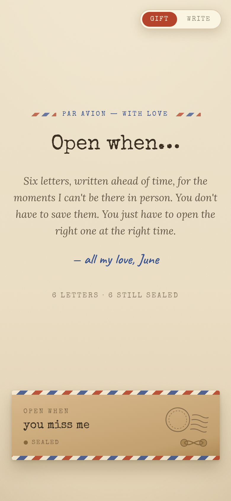

# Open When — Letters for Later

A bundle of digital "open when…" letters: six kraft air-mail envelopes,
tied with string, that untie and unfold right on the page. Each holds a
letter on ruled paper — some with a photograph under a paperclip — for
the moments you can't be there in person: *open when you miss me, when
you can't sleep, when we've had a fight, when you need a laugh…*

And the trick paper can't do: any letter can be **sealed until a date
you choose**. The envelope shows a live countdown, and politely refuses
to open early — perfect for an anniversary or birthday letter.

Everything is **one single file** (`index.html`). No build step, no
accounts, no code required. You change the words and photos right in
the browser.



---

## Quick start

1. **Open it.** Double-click `index.html` and it opens in your web browser.
2. **Write it.** Tap **Write** in the top-right corner.
   - Tap any line of words to rewrite it — labels, letters, P.S. lines,
     signatures, all of it.
   - Tap a photo frame inside a letter to add a picture from your device.
   - Tap **Reset** in the bottom bar to undo everything (this also
     re-seals opened letters).
3. **Gift it.** Tap **Gift** to see the finished bundle.
4. **Share it** (see [Sharing & hosting](#sharing--hosting) below).

> Your edits save automatically **in the browser you edit them on.** To
> deliver the finished bundle to someone else, host it online — see below.

---

## What you can change without touching any code

Tap **Write**, then tap directly on any of these:

| Where | What it is |
| --- | --- |
| Masthead | The intro note and the "all my love" line |
| Every envelope | Its "open when …" label |
| Every letter | Every paragraph, the P.S., and the signature |
| Photos | Two paperclipped photographs (letters 1 and 4) |
| Sign-off | The closing line at the bottom |

---

## Sealing a letter until a date

Open `index.html` in any plain text editor. Near the bottom, in the
`<script>` tag, there is a small `CONFIG` block:

```js
var CONFIG = {
  locks: {
    l5: '2027-06-14'        // letter 5 stays sealed until this date
  },
  defaultMode: 'gift',      // 'gift' (view) or 'write' (edit)
  storageKey: 'openwhen_'   // keeps separate bundles from clashing
};
```

- Letters are numbered `l1` (top) through `l6` (bottom). Add a line like
  `l2: '2026-12-25',` to seal any of them; remove a line to unseal.
- A sealed envelope shows **"opens in N days"** and a red *Sealed until*
  stamp, and shakes its head if opened early. On the day, it unlocks by
  itself.
- In **Write** mode locks are ignored, so you can always edit your own
  letters.
- Honest note: this is a gift, not a vault — the words are inside the
  file, so a determined snoop with the source code could peek. For the
  person you love, the countdown is the magic.

### Adding a seventh letter

Copy a whole `<article class="env" ...>...</article>` block, give it a
new `data-id` (for example `l7`), and give every `data-f` field inside
it a new, unique name (for example `lbl-7`, `let-7a`, `ps-7`, `sig-7`).
The counter at the top finds it automatically.

---

## Sharing & hosting

Because it is a single file, you have easy options:

- **Send the file.** Email or AirDrop `index.html`. The recipient
  double-clicks it. (Edits made in your own browser won't travel with
  the file — host it online, or bake them into the HTML, to share them.)
- **Free hosting.** Drag `index.html` onto [Netlify Drop](https://app.netlify.com/drop)
  or push it to a [GitHub Pages](https://pages.github.com/) repo to get
  a private link you can text to someone.
- **A QR code.** Turn the hosted link into a QR code and tuck it inside
  a real card, a suitcase, or a coat pocket.

To bake your words in permanently (so they show for everyone,
everywhere), edit the text directly in `index.html` between the `>` and
`</...>` of each `data-f` element, instead of only editing in the browser.

---

## Good to know

- **Fonts** load from Google Fonts, so the exact lettering needs an
  internet connection. Offline, it falls back to clean system faces.
- **Works on** phones, tablets, and computers, in any modern browser.
- **Respects "reduce motion"** — envelopes open instantly, without the
  full unfolding.
- **Photos** are stored only in the viewer's own browser; nothing is
  uploaded anywhere. This keeps it completely private.
- **Opened / sealed** states are remembered per device, so the counter
  at the top reflects the recipient's own progress through the bundle.

---

## Files in this package

| File | What it's for |
| --- | --- |
| `index.html` | The bundle itself. This is the whole product. |
| `README.md` | This guide. |
| `etsy-listing.md` | Suggested listing copy (for sellers). |
| `preview/` | Preview images. |

Made with love. Open the right one at the right time. ✉
